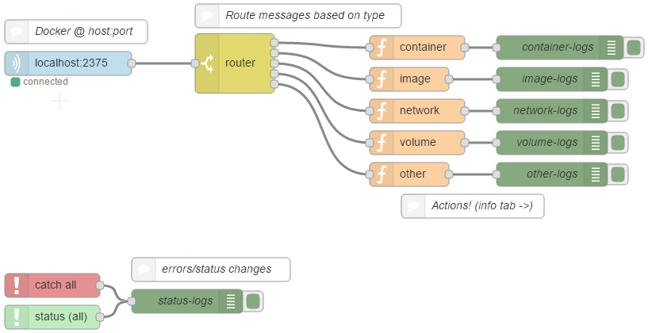

# node-red-contrib-docker-stream

I thought Node-RED was a pretty cool guy. Docker is pretty darn nifty, too. This is the beginnings of
what should hopefully be a nice collection of nodes to allow for interactions between the two.

Right now there is support for monitoring a docker daemon's event stream, but I'm currently mulling over
how to provide a clean interface for functional interactions with docker. Please feel free to open an issue
if you have something specific you'd like to do.


## Installation

General node installation instructions can be found [here](http://nodered.org/docs/getting-started/adding-nodes)
for Node-RED. But it boils down to this:

```bash
cd $HOME/.node-red # Or whever your Node-RED user data directory is
npm install node-red-contrib-docker-stream
```

## Usage

An example flow can be found in `example/`.



## Contributing

1. Fork it!
2. Create your feature branch: `git checkout -b my-new-feature`
3. Commit your changes: `git commit -am 'Add some feature'`
4. Push to the branch: `git push origin my-new-feature`
5. Submit a pull request :D
